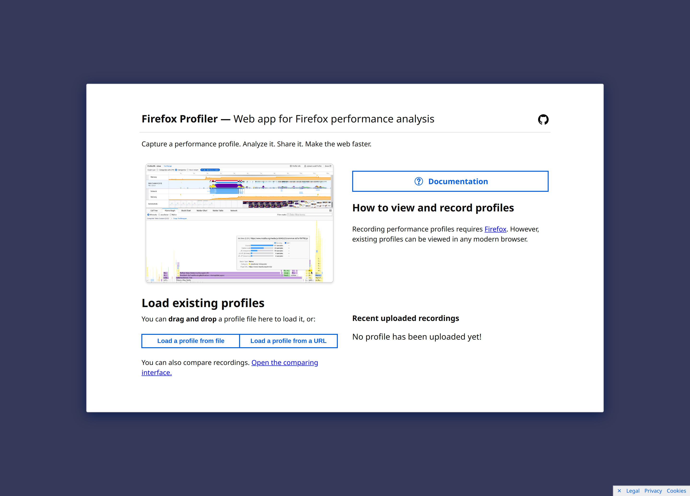
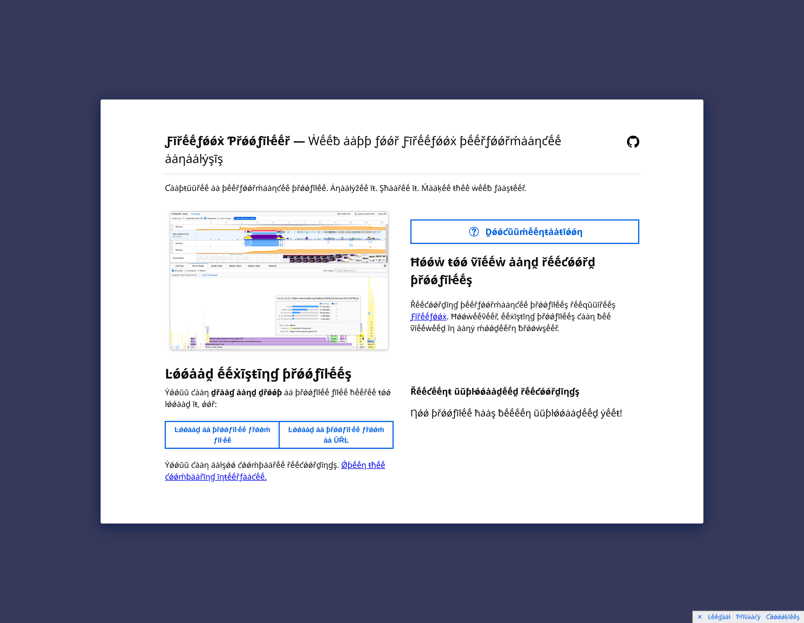
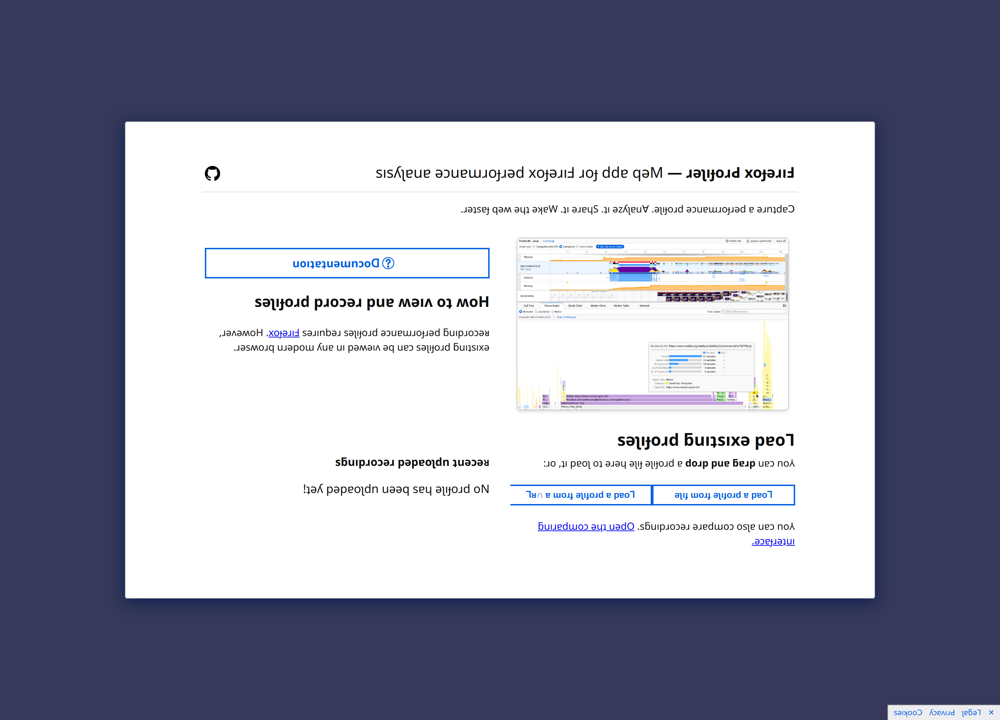

Hello Everyone! So I have completed my Outreachy Internship with Mozilla (_sigh_). It was an exciting journey. Let me ~~walk~~ tell you through the final experinece :)

Reading this post you will get to know..

- What was one fear I had about the internship that turned out to not come true?
- What was one amazing thing that happened during the internship?
- How did my Outreachy internship help me grow my skills? (Communication skills, Technical skills)
- How did my Outreachy mentor help me along the way?
- How did Outreachy help me feel more confident in making open source and free software contributions?
- What parts of my projects did I complete?
- What are the next steps for me (or someone else) to complete the project?

# Internship Experience and Outcomes in General Term

I never had full-time working experince before. I've always thought it's kinda strict to maintain 9 to 5 work schedule. I always wondered it's kinda robotic and I won't be able to do such. In this internship I realized that no one actually can maintain the schedule perfectly. And if it's remote, the schedule doesn't remain the same. Without worrying about the timefarame, We all have to adjust and work best whenever we are capable.

The one thing I most enjoyed during the internship was my Pair Programming session with my mentor Nazim Can Altinova. It was my first time pair programming and my mentor is amazing. He is helpful and very welcoming person. We resolved an issue about `fetching static files in the site during initial load`. Initially I was nervous, but after discussing for a while I became comfortable and did manage to get to the solution.

Outreachy Intership did help me growing some skills like, time-management, communication, work-life balance, getting out of comfortzone (not a skill but an important thing we should consider). Other than these, my technical skills improved too such as using React, Readux, Testing tools like React Testing Library, Jest, Writing FTL(translation) files for providing Localization, etc.

Other than pair programming one more thing I enjoyed was my 1:1 sessions with my mentor. Every week we had the meeting and discussed the state we were at and what can be done to move forward in terms of the tasks. During the internship time, sometimes I couldn't hit the targeted tasks, sometimes I panicked too. My mentor always gave me support, inspired and helped whenever I struggled.

Outreachy made a great impact on me about contributing to FOSS projects. I love the beauty of FOSS. It poses a great impact in software production. According to RedHat's site,
"Open source software is developed in a decentralized and collaborative way, relying on peer review and community production. Open source software is often cheaper, more flexible, and has more longevity than its proprietary peers because it is developed by communities rather than a single author or company." According to me, contributing to open source is the best way to level up one's portfolio.

I've listed the tasks my internship project in this [Github Issue](https://github.com/firefox-devtools/profiler/issues/3094). I couldn't complete all the tasks during the 12 week internship period. I have roughly completed 80%-85% of the intended tasks. The completion of tasks was not always according to plan. Some took more time, some were re-done. So the timeline didn't went exactly as it was planned which is natural. During the internship I also had sit for my bachelor's final exams (Due to Covid-19 the changed exam dates overlapped) which also made me go CRAZY! I am planning to take a little break now and then assist to complete some tasks that could have been done by me. I am also preparing to participate in GSoC this year. Hoping to be in touch with my Profiler Team!

Now that I have shared my experience in general way, let me show you some real work!

# Internship Experience and Outcomes in Technical Term

The [Profiler Site](https://profiler.firefox.com/) was not localized before, now it can be LOCALIZED!

_**Before...**_

  

_**After...**_

Accented Pseudo Localization Enabled (Shows Different Locale Text Support):

  

Bidi Pseduo Localization Enabled (Shows Left to Right Locale Text Support):

  

-- **Pseudolocalization** (or pseudo-localization) is a software testing method used for testing internationalization aspects of software. Instead of translating the text of the software into a foreign language, as in the process of localization, the textual elements of an application are replaced with an altered version of the original language. (By _Wikipedia_)

## What My Contributions Does, What I learned..

My contributions can be found here-> [Github Issue](https://github.com/firefox-devtools/profiler/issues/3094).

**Brief description of what these `"Code"` does:
**

- l10n Package: Integrates new package "Fluent Js" into the codebase (Fluent is a research project by Mozilla) to support l10n.

- Store/State Management: Redux store, actions, reducers, and selectors for l10n features like requesting/receiving FTL (translation) files.

- Conventional and default FTL file for providing translation texts depending on users' locale, en-US by default.

- Tests for supporting l10n features. Such as initial load of the site, fetching FTLs, etc.

- Localization provider as a wrapper component to fetch and show texts from the FTL files instead of hardcoded strings inside react components.

**Things I have learned while making the contributions:
**

- Inspecting a large project and integrating new package in a codebase existing multiple tools like Webpack, Flow, Es-lint, etc.

- Reading documentation and finding examples to provide solutions on how to appropriately integrate the Fluent package into the "Profiler" project.

- First time using redux for state management. Learned uses of actions, reducers, and selectors.

- The conventions of writing FTL files. Such as using variables, numbers, date format in different locales.

- Using testing tools like React Testing Library, Jest.

- Fine inspection of the codebase to find out the hardcoded strings to make translatable texts.

- Supporting file fetching using Webpack to handle the initial load of the site using the default locale.

- Understanding the Profiler website as a whole to implement localization features.

- Team collaboration, pair programming, and getting out of my comfort zone.

# Final Thoughts and Future Planning..

I am grateful to have this opportunity. It will be an impactful thing in my life to go farther in my career. I am now focusing to aim for higher studies and remote job as a Software Engineer. I have faced obstacles and I have overcame them. I am now confident enough to aim for bigger goals and brighter dreams!

---

I hope you had fun my blog posts! Don't hesitate to ping me if you want to know more about Outreachy or any other thing. I'd love to chat with you! You can find ways to contact me here -> [Hasna Hena Mow](https://ciphergirl.github.io/)
